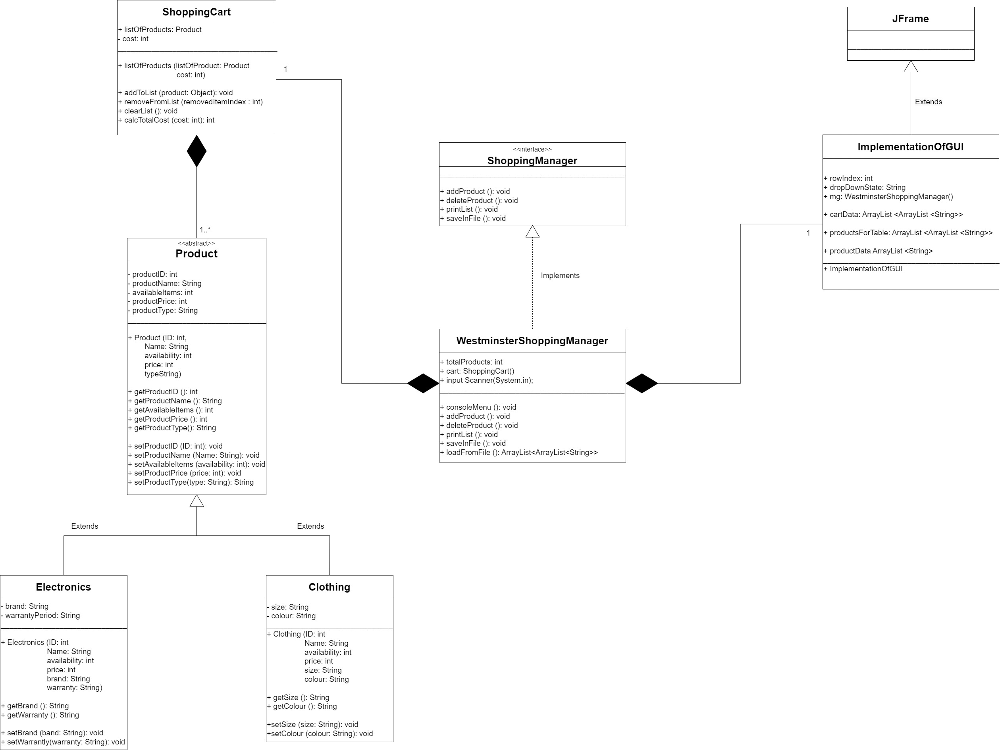
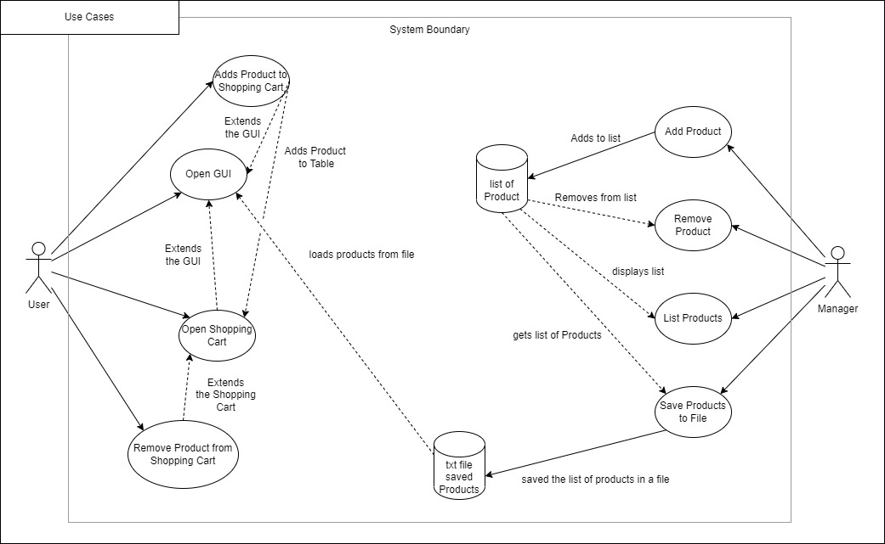
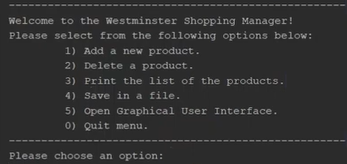
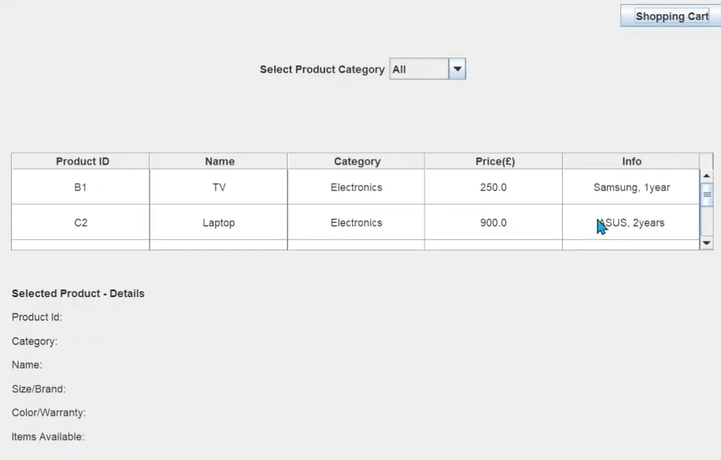

# Westminster Shopping Manager

A Java-based Shopping Manager application developed as a coursework project for the Object-Oriented Programming module (December 2023).

## Overview

The Westminster Shopping Manager is a dual-interface application that serves both managers and customers. It features a terminal-based menu for managers and a graphical user interface (GUI) for customers.

### Class and Use Case diagrams
Class and Use Case diagrams were also created as part of the project development:

## Features

### Manager (Terminal)
- Add new products
- Delete existing products
- Print the full product list as an array
- Save the product list to a file
- See terminal:

### Customer (GUI)
- Browse all available products in a table
- Filter products by category (Electronics, Clothing)
- Select a product to view its details
- Add products to a shopping cart with a running total price
- See GUI:

## Technologies
- Java (OOP principles)
- Java Swing (GUI)

## How to Run
1. Download the project or clone the repo
2. Open the project in NetBeans
3. Build and run the project
4. Use the console menu to manage products, or launch the GUI for the customer view
